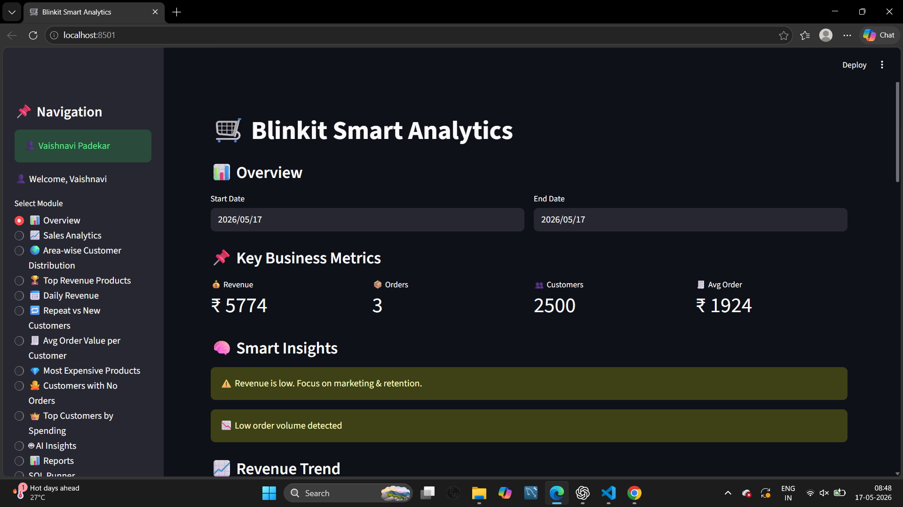

📌 Project Description

The Blinkit Sales Analytics Dashboard is an interactive data analytics web application built using Streamlit. It provides real-time insights into sales performance, customer behavior, and business trends using structured retail data.
This project simulates a real-world analytics system for a quick-commerce platform like Blinkit, helping businesses make data-driven decisions through visual dashboards and smart insights.

🚀 Key Features:

📊 1. Business Overview Dashboard:

- Displays key KPIs like:
- Total Revenue
- Total Orders
- Customer Count
- Average Order Value
- Includes dynamic date filtering
  
📈 2. Sales Analytics:

- Top-selling products
- Revenue trends over time
- Daily and monthly performance tracking
  
🌍 3. Customer Insights:

- Area-wise customer distribution
- Repeat vs new customer analysis
- Customer segmentation (basic RFM logic)
  
🏆 4. Product Insights:

- Top revenue-generating products
- Most expensive and cheapest products
  
🔐 5. Authentication System:

- User registration & login
- Session-based authentication
  
💻 6. SQL Runner:

- Run custom SQL queries directly from UI
- Helps in dynamic data exploration
  
🛠️ Tech Stack:

- Frontend & App Framework: Streamlit
- Programming Language: Python
- Database: PostgreSQL
- Data Processing: Pandas
- Visualization: Matplotlib
  
🎯 Project Objectives:

- Analyze retail sales data efficiently
- Identify trends and patterns in customer behavior
- Provide actionable business insights
- Build a real-world end-to-end data analytics application
  
🌐 Deployment:

- Hosted on Streamlit Community Cloud
- Database hosted on platforms like Railway
  
📊 Use Cases:

- Retail business performance tracking
- Customer behavior analysis
- Sales forecasting
- Data analytics portfolio project
  
🧠 Future Enhancements:

- Advanced machine learning models
- Real-time data streaming
- Secure password hashing (bcrypt)
- Role-based user access

Images : 

1. ## 📸 Project Login System

2. ## Overview Of Project

3. ## SQL Runner

👩‍💻 Author:

Developed by Vaishnavi Padekar
